# 📄 PDF Merge & Normalize Tool

<div align="center">

[](https://python.org)
[](https://opensource.org/licenses/MIT)
[](http://makeapullrequest.com)

*A Python script to intelligently merge multiple PDF files with automatic width normalization*

[Features](#-features) • [Installation](#-installation) • [Usage](#-usage) • [Examples](#-examples) • [Contributing](#-contributing)

</div>

---

## 🎯 Overview

Handling PDFs of varying sizes can be challenging. When merging, inconsistent page widths can lead to a disjointed and unprofessional final document. This tool solves that problem by intelligently normalizing all pages to ensure a consistent and clean final document.

### 🔧 What it does:

- 📏 **Analyzes** the dimensions of every page in your PDFs
- 🎯 **Identifies** the narrowest page width across all files
- 📐 **Resizes** all pages to match this minimum width while preserving aspect ratio
- 🔗 **Merges** the normalized pages into a single, cohesive PDF
- 🧹 **Cleans up** all temporary files automatically

Perfect for combining documents like invoices, reports, and scanned files into one standardized PDF.

---

## ✨ Features

<table>
<tr>
<td>

### 🎨 **Width Normalization**
Automatically resizes all pages to the narrowest width for a uniform look

</td>
<td>

### 📐 **Aspect Ratio Preservation**
Avoids distortion by scaling page height proportionally

</td>
</tr>
<tr>
<td>

### 📁 **Multiple File Support**
Merge two or more PDF files at once

</td>
<td>

### 🔍 **Dimension Analysis**
Inspect PDF dimensions before merging

</td>
</tr>
<tr>
<td>

### 🧹 **Automatic Cleanup**
Creates temporary directory and removes it upon completion

</td>
<td>

### 🪶 **Lightweight**
Only depends on PyPDF2 and reportlab

</td>
</tr>
</table>

---

## 🚀 Installation

### Prerequisites

- **Python 3.10+** installed on your system
- **pip** package manager

### Install Dependencies

```bash
pip install PyPDF2 reportlab
```

### Clone Repository

```bash
git clone https://github.com/SakibAhmedShuva/Merge-PDF-with-Python.git
cd Merge-PDF-with-Python
```

---

## 💻 Usage

### Basic Usage

1. **Configure your PDF files** in the script:

```python
# Example usage
if __name__ == "__main__":
    # YOUR PDF FILES
    # Use raw strings (r"...") for Windows paths to avoid issues with backslashes
    pdf_files = [
        r"path/to/your/first/document.pdf",
        r"path/to/your/second/document.pdf",
        # Add more files as needed
    ]

    # Define the output filename
    output_filename = "merged_document.pdf"

    # First, analyze the dimensions (optional)
    analyze_pdf_dimensions(pdf_files)

    # Then, merge with resizing
    merge_pdfs_with_resize(pdf_files, output_filename)

    print("\n=== Process Complete ===")
    print("All PDFs have been resized to match the smallest width and merged!")
```

2. **Run the script**:

```bash
python pdf_merger.py
```

### Advanced Options

- **Analyze dimensions only**: Use `analyze_pdf_dimensions(pdf_files)` to inspect your PDFs before merging
- **Custom output path**: Specify any path for your merged PDF output
- **Batch processing**: Add as many PDF files as needed to the `pdf_files` list

---

## 📊 Examples

### Console Output

```
=== PDF Dimension Analysis ===

File: documents/invoice_001.pdf
  Page 1: 595.3 x 841.9 points (8.3" x 11.7")

File: documents/report_q1.pdf
  Page 1: 692.1 x 978.8 points (9.6" x 13.6")

=== Analyzing PDF dimensions ===
Minimum width found: 595.3 points

=== Resizing PDFs ===
Page 1: 595.3x841.9 -> 595.3x841.9
Successfully resized documents/invoice_001.pdf -> temp_resized/temp_resized_0.pdf
Page 1: 692.1x978.8 -> 595.3x841.9
Successfully resized documents/report_q1.pdf -> temp_resized/temp_resized_1.pdf

=== Merging resized PDFs ===
Adding: temp_resized/temp_resized_0.pdf
Adding: temp_resized/temp_resized_1.pdf
Successfully merged 2 resized PDFs into 'merged_normalized_width.pdf'

=== Cleaning up temporary files ===
Removed: temp_resized/temp_resized_0.pdf
Removed: temp_resized/temp_resized_1.pdf
Removed directory: temp_resized

=== Process Complete ===
All PDFs have been resized to match the smallest width and merged!
```

### Workflow Diagram

```mermaid
graph TD
    A[📁 Input PDFs] --> B[📏 Analyze Dimensions]
    B --> C[🎯 Find Minimum Width]
    C --> D[📐 Resize Pages]
    D --> E[🔗 Merge PDFs]
    E --> F[🧹 Cleanup Temp Files]
    F --> G[✅ Final PDF Output]
```



---

## 🛠️ How It Works

<details>
<summary><strong>🔍 Click to expand workflow details</strong></summary>

### Step-by-Step Process

1. **📊 Dimension Analysis**
   - Inspects each PDF file
   - Determines width and height of every page
   - Logs dimensions for user review

2. **🎯 Minimum Width Detection**
   - Calculates minimum width across all pages
   - Sets this as the target normalization width

3. **📐 Page Resizing**
   - Scales each page to target width
   - Maintains original aspect ratio
   - Saves resized pages as temporary files

4. **🔗 PDF Merging**
   - Combines temporary PDFs in specified order
   - Creates final output file

5. **🧹 Cleanup**
   - Removes all temporary files
   - Deletes temporary directory
   - Leaves only the final merged PDF

</details>

---

## 🤝 Contributing

We welcome contributions! Here's how you can help:

### 🐛 Report Issues
Found a bug? [Open an issue](https://github.com/SakibAhmedShuva/Merge-PDF-with-Python/issues) with:
- Clear description
- Steps to reproduce
- Expected vs actual behavior

### 💡 Suggest Features
Have an idea? [Start a discussion](https://github.com/SakibAhmedShuva/Merge-PDF-with-Python/discussions) or open an issue with the `enhancement` label.

### 🔧 Submit Pull Requests

1. **Fork** the repository
2. **Create** your feature branch
   ```bash
   git checkout -b feature/AmazingFeature
   ```
3. **Commit** your changes
   ```bash
   git commit -m 'Add some AmazingFeature'
   ```
4. **Push** to the branch
   ```bash
   git push origin feature/AmazingFeature
   ```
5. **Open** a Pull Request

---

## 📋 Requirements

| Requirement | Version | Purpose |
|-------------|---------|---------|
| Python | 3.10+ | Core runtime |
| PyPDF2 | Latest | PDF manipulation |
| reportlab | Latest | PDF generation |

---

## 📄 License

This project is licensed under the **MIT License** - see the [LICENSE](LICENSE) file for details.

---

## 🙏 Acknowledgments

- Built with [PyPDF2](https://pypdf2.readthedocs.io/) for PDF manipulation
- Powered by [ReportLab](https://www.reportlab.com/) for PDF generation
- Inspired by the need for consistent document formatting

---

<div align="center">

### ⭐ Star this repository if you find it helpful!

**Made with ❤️ by [SakibAhmedShuva](https://github.com/SakibAhmedShuva)**

</div>
